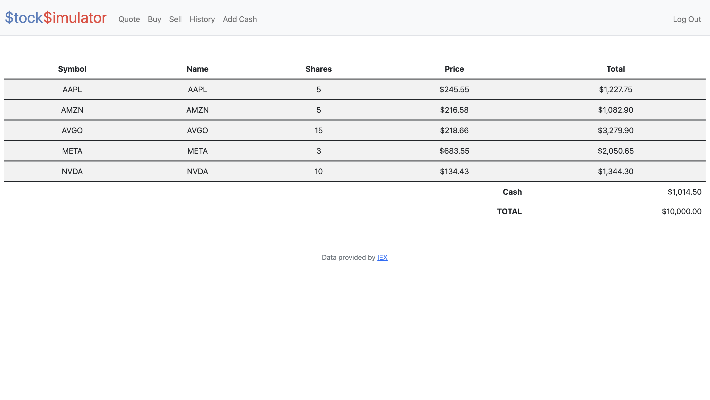
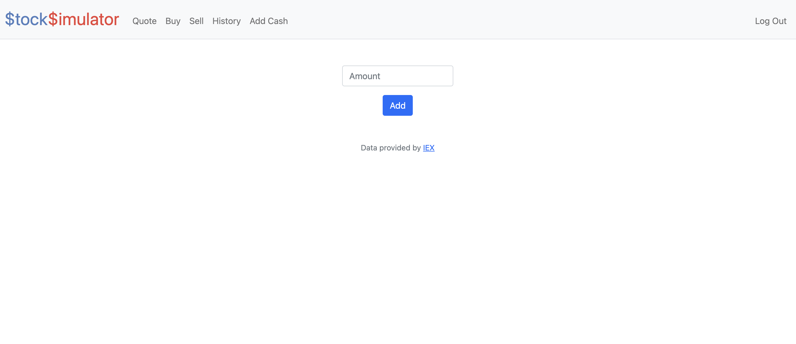
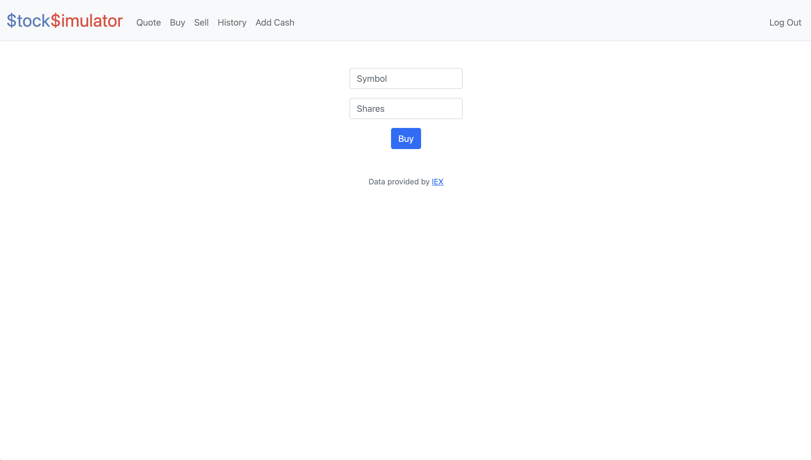
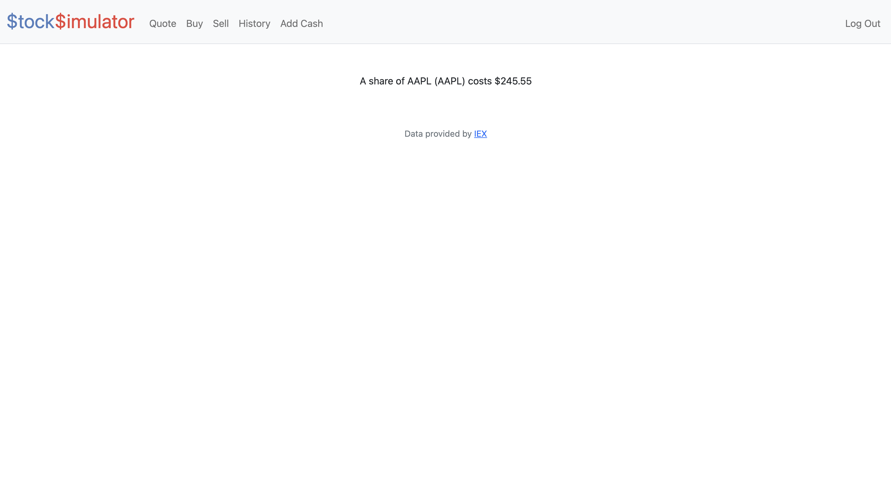
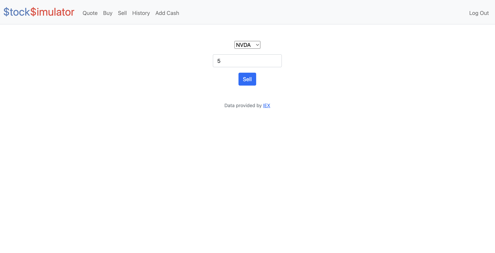
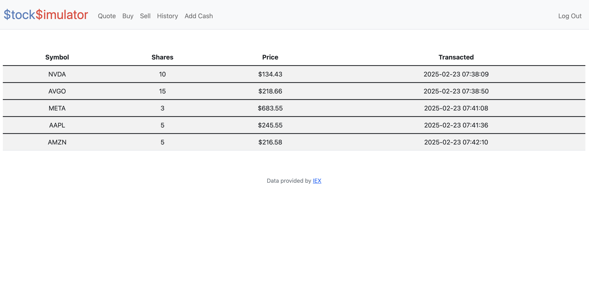

# Stock Trading Simulator

This project involves the development of an interactive platform that simulates the experience of investing in the stock market. Users can create and manage virtual stock portfolios with real-time price updates.

## Features

- **Real-Time Market Data:** Leveraged the Yahoo Finance API to provide accurate and up-to-date market data.
- **Portfolio Management:** Users can create, view, and manage their virtual stock portfolios.
- **Transaction Simulation:** Simulate buying and selling stocks with virtual currency.
- **Performance Tracking:** Track the performance of your portfolio over time with historical data and analytics.
- **Transaction History:** View the history of all your transactions.
- **Stock Lookup:** Look up the current price of any stock on the market.
- **User-Friendly Interface:** Intuitive and interactive interface for a seamless user experience.

## Getting Started

### Installation

1. Install the required packages:
    ```sh
    pip install -r requirements.txt
    ```
### Running the Simulator

1. Start the application:
    ```sh
    flask run
    ```

2. Click on the generated link to access the platform.

## **Feature Demonstrations**

### **Portfolio View**
The **portfolio page** provides a **comprehensive overview** of **current holdings**, **cash balance**, and **total portfolio value**.



---

### **Add Cash**
The **add cash feature** allows users to **increase their portfolio balance**, enabling **more trading opportunities**.



---

### **Buy Stocks**
The **buy feature** provides a **simple interface** to **purchase shares** of **publicly traded companies** using their **ticker symbols**.



---

### **Get Stock Quote**
The **quote feature** displays the **current price** of a **selected stock**, offering **real-time market insights**.



---

### **Sell Stocks**
The **sell feature** allows users to **select stocks** from their **portfolio** and **sell shares** easily.



---

### **Transaction History**
The **transaction history page** logs **all trades** and **cash transactions**, providing **full transparency**.


